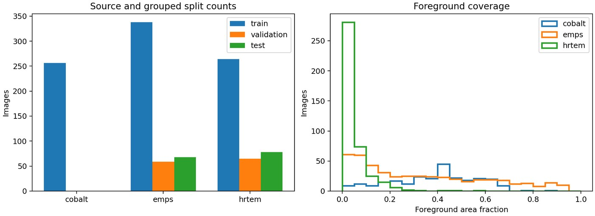
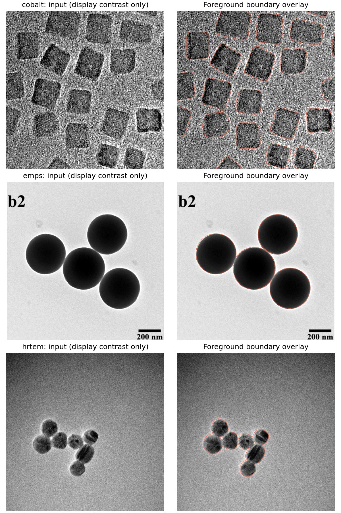
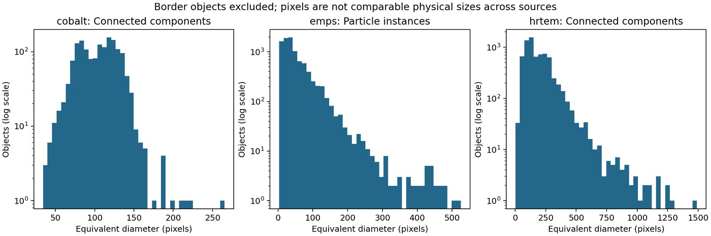

# Project A: reproducible electron-microscopy image ETL

Course project: combine EMPS, HRTEM nanoparticles, and Co3O4 training data into
one SQLite database for segmentation model development and preliminary figures.
This repository implements the ETL stage, not model training or the instructor's
held-out evaluation server.

## Assignment submission and execution

Repository URL to submit:

https://github.com/billalgio103-glitch/Special-Topic

This submission uses the Git repository option in the assignment instructions.
The repository contains all code needed to download the source data and construct
the fully populated database. A separate `.tar.gz` submission is not required.

Install Git, **Podman**, and **just** on the host, start Podman if your operating
system requires a Podman VM, then run the assignment's one-line command:

```sh
git clone https://github.com/billalgio103-glitch/Special-Topic.git && cd Special-Topic && just
```

On successful completion, `data/particles.db` contains all **1,128 image
records** (465 EMPS, 407 HRTEM and 256 Co3O4) and **23,386 instance/component
measurements**. The same command also generates CSV exports and three
preliminary figures in `data/figures/`. No manual data download or separate
database population command is needed.

On Windows use the instructor's WSL/Ubuntu setup. Run commands inside Ubuntu.
No API key, GPU, or private data credentials are needed for these public sources.
The first run downloads large native microscopy files. Allow **at least 40 GB
of free disk space** including the container and temporary transfers, and a
stable connection. Subsequent runs verify and reuse cached source files.

The entry point follows the supplied template's direct-Podman route:

`Justfile -> Containerfile -> Makefile -> scripts/*.py -> data/particles.db`

`compose.yml` is unnecessary for this single-container workflow. The default
recipe downloads all three sources and fails if a required file is unavailable
or corrupted. It never silently substitutes synthetic data or submits a subset.

## Outputs

| Path | Contents |
| --- | --- |
| `data/particles.db` | Sources, asset provenance, 1,128 image records, object measurements, and SQL views |
| `data/raw/` | Original images and labels, downloaded automatically |
| `data/processed/masks/` | Aligned binary PNG targets, foreground 255 and background 0 |
| `data/exports/training_manifest.csv` | Image/target references, array indices, groups and splits |
| `data/exports/dataset_summary.csv` | Counts and coverage ready for preliminary figures |
| `data/exports/size_measurements.csv` | Border-excluded instance/component measurements |
| `data/figures/` | Dataset overview, label overlays, and pixel-size histograms |
| `data/validation.json` | Completeness, integrity and split-isolation checks |

## Generated result preview

The checked execution produced 1,128 image records and 23,386 measured particle
instances or connected components. A compact generated summary is available at
[`docs/results/dataset_summary.csv`](docs/results/dataset_summary.csv).

### Dataset composition and foreground coverage



### Input/target alignment quality control

Red contours show the supplied ground-truth mask boundaries, not model
predictions.



### Object-size distributions

These diameters are in pixels. Pixel sizes are not directly comparable between
the three sources.



**The DB contains measurements and references, not duplicate multi-GB image
BLOBs.** Keep the entire generated `data/` directory when moving the database.
The original data and normalized masks are required for training. All paths
inside the DB are relative to this directory (`assets.asset_path` is relative
to `data/raw/`). `scripts/common.py:training_pair` reads any of the three native
formats and returns a full-resolution float32 image and binary target.

For example, from the repository root in Python:

```python
import sqlite3
import sys
from pathlib import Path
sys.path.insert(0, "scripts")
from common import training_pair

con = sqlite3.connect("data/particles.db")
con.row_factory = sqlite3.Row
record = dict(con.execute("SELECT * FROM images WHERE split='train' LIMIT 1").fetchone())
x, y = training_pair(record, Path("data"))
con.close()
```

## Sources and conversions

| Source | Samples | Native inputs | Interpretation |
| --- | ---: | --- | --- |
| [EMPS](https://github.com/by256/emps) | 465 | PNG images, uint16 PNG masks | Preserve particle instance IDs for measurements; derive binary targets with label > 0 |
| [HRTEM nanoparticles](https://doi.org/10.7941/D1SP93) | 407 | DM3 images, PNG labels | Read float image data and spatial calibration from DM3; labels are binary |
| [Co3O4](https://zenodo.org/records/14927582) | 256 | `training_images.h5`, `training_labels.h5` | Read `images` and `labels` arrays; channel 1 is foreground, following the authors' training notebook |

HRTEM downloads use the authors' [NERSC mirror](https://portal.nersc.gov/project/m3795/hrtem-generalization/),
with paths from the pinned [metadata repository](https://github.com/ScottLabUCB/HRTEM-Generalization).
Its 407 records have nonunique basenames: the complete original acquisition
folder plus filename identifies a record. Local filenames are stable hashes of
that full path. No record is dropped merely because its basename repeats.

For cobalt, only the two labeled training HDF5 files are needed for this first
ETL stage. The separate 6.4 GB `TEM_images.zip` and model-predicted segmentation
archive are not substituted for the hand-labeled training examples.

Raw values are retained. RGB EMPS images are converted to luminance only when
loaded. There is no geometric resizing, cropping, guessed calibration, or
intensity clipping. `training_pair` performs per-image z-score normalization;
it does not fit statistics using validation/test images. Figure contrast
adjustments affect display only.

## Schema and scientific limits

See `schema.sql`. Tables are connected through explicit primary/foreign keys:

- `sources`: dataset provenance, source revision, license, expected counts.
- `assets`: downloaded URL, relative path, byte count and SHA-256.
- `images`: parent identity, paired assets, dimensions, dtype, target type,
  calibration, split, acquisition metadata and foreground summary.
- `objects`: label identity, area, equivalent-circle diameter and border flag.

**Instance IDs and connected components are different measurements.** EMPS
instance labels identify separate particles even when they touch. HRTEM and
cobalt binary labels do not: touching particles may merge into a component.
The DB records `object_kind`, and figures label components explicitly. No
watershed-generated guesses are represented as ground-truth instances.

HRTEM's calibrated pixel sizes come from each DM3 header, converted to nm. The
metadata CSV's rounded `Pixel Scale (nm)` is retained for reference, not silently
substituted for the header. EMPS scale bars require individual calibration;
their scale is left NULL. Cobalt's record describes 67–86 pm pixels but its
training HDF5 arrays do not identify a per-image scale; these values are also
NULL. Never assign the range midpoint to all images. Thus cross-source physical
particle-size comparison is not yet justified. The `particle_sizes_nm` view may
correctly be empty until instance images receive verified calibrations.

For each object, `diameter = sqrt(4 * area / pi)`. If calibrated,
`area_nm2 = area_px * pixel_size_x_nm * pixel_size_y_nm`, allowing anisotropic
pixels. Objects touching any image boundary are recorded but excluded from
`size_measurements` and the default size histograms. Binary components use
8-connectivity, which is explicit and consistent across sources.

## Training/evaluation splits

Splits use a fixed SHA-256 ordering of source groups, approximately 70/15/15
by group (not by image count). EMPS groups are paper DOIs; HRTEM groups are
acquisition folders. A group's images always stay together. These replace the
EMPS author's image-level split to reduce related-image leakage.

Cobalt's patch-to-parent mapping is unavailable. All cobalt patches are kept
in training, so we do **not** claim an independent cobalt validation/test set.
Validation/test records come from EMPS and HRTEM. Any later patches or augmented
images must inherit their parent's split. The instructor's private test set
remains separate and is not included here.

## Reproducibility and idempotency

- `sources.lock.json` enumerates every expected asset and sample. GitHub content
  is pinned to commit revisions and Git blob hashes; Zenodo files use the
  published version, byte sizes and checksums. HRTEM content is locked by
  SHA-256 after retrieval, since NERSC does not publish individual hashes.
- `requirements.lock` pins direct and transitive Python dependencies. The
  container base is pinned by digest.
- Downloads use temporary files, HTTP error checking, retry, content validation
  and atomic renaming. A missing file is an error, not an empty DB row.
- The database is rebuilt in a temporary SQLite file and replaces the prior
  DB only after successful parsing and integrity checks. No append-only
  ingestion or duplicate accumulation occurs.
- Output rows and groups have deterministic identities and ordering. No
  retrieval timestamps or absolute workstation paths enter the DB fingerprint.

After `just`, run:

```sh
just verify
just idempotency
```

The second command builds twice from the same source files and checks exact
logical table fingerprints and row counts. It writes `data/idempotency.json`.

## Local development without containers

```sh
python3 -m venv .venv
. .venv/bin/activate
python -m pip install -r requirements.lock
make all
make test
make idempotency
```

For a development subset only, pass `--limit 2` to `download.py` and
`build_db.py`, then use `verify.py --allow-subset`. Cobalt's HDF5 files still
need downloading in full. A subset is **not** a complete assignment submission.

## Example database queries

```sql
SELECT * FROM dataset_summary;

SELECT source_id, calibration_status, COUNT(*)
FROM images GROUP BY source_id, calibration_status;

SELECT source_id, object_kind, equivalent_diameter_px
FROM size_measurements;
```

## Attribution

EMPS: Yildirim and Cole, *Bayesian Particle Instance Segmentation for Electron
Microscopy Image Quantification*, DOI: 10.1021/acs.jcim.0c01455, MIT license.
HRTEM: *Generalization Across Experimental Parameters in Machine Learning
Analysis of High Resolution Transmission Electron Microscopy Datasets*,
data DOI: 10.7941/D1SP93 (CC0 per course handout); related code is MIT licensed.
Cobalt: Cho and Scott, Zenodo DOI: 10.5281/zenodo.14927582, related article
DOI: 10.1021/acsnano.4c09312 (CC BY 4.0 per course handout).
See the original records for full attribution and license terms.

## Verification status

See [VALIDATION.md](VALIDATION.md) and the reports in `validation/` for the
full-source execution and idempotency results. The
[GitHub Actions workflow](https://github.com/billalgio103-glitch/Special-Topic/actions/workflows/etl.yml)
repeats the default `just` command in a clean Podman environment on code changes.
